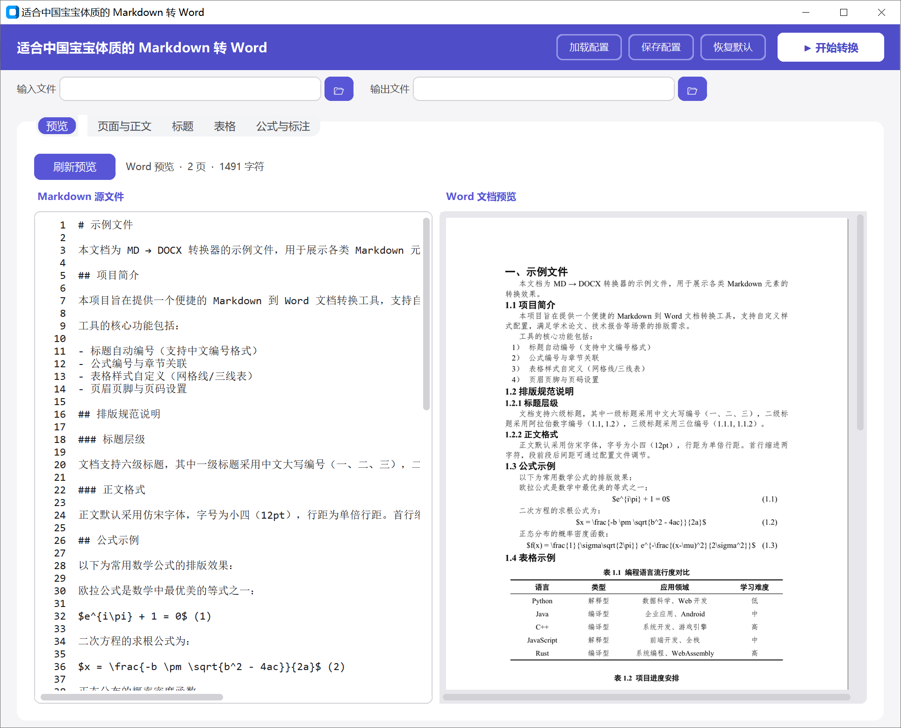

# Md2word-ai-academic — 适合中国宝宝体质的 Markdown 转 Word

> 🎓 专为**中文学术论文、横向/纵向科研项目报告**打造的 MD → Word 一键转换工具。

## 这个工具解决什么问题？

在 AI 时代，大模型（ChatGPT / Claude / DeepSeek / Kimi 等）已经成为学术写作和项目报告的重要辅助工具。然而大模型生成内容存在一个核心矛盾：

| | Markdown 输出 | Word 输出 |
|---|---|---|
| **生成速度** | ⚡ 快（流式输出，token 效率高） | 🐢 慢（需要额外渲染） |
| **格式质量** | 结构清晰，语法简洁 | 😭 格式混乱，样式不统一 |
| **公式支持** | LaTeX 原生支持 | 🤷 无好的解决方案 |

**Markdown 是大模型最理想的中间产物** ——输出速度快、结构化程度高、公式表达完整。但中国学术界和项目管理的交付标准是 **Word 文档**，而且对格式有严格要求（字体、编号、三线表、页边距等）。

现有的 MD → Word 方案（Pandoc 等）对中文学术场景支持很差。**本工具就是为了补上这最后一公里** 🏃：让你用 AI 高效生成 Markdown 内容，然后一键转换为格式规范、可以直接交给导师/上级/甲方的 Word 文档。

## ✨ 核心特性

- **中文学术规范开箱即用**：正文仿宋、标题黑体、英文 Times New Roman，符合中国学术论文和项目报告的格式标准
- **标题自动编号**：按中国学术惯例自动编号（一、→ 1.1 → 1.1.1 → 1.1.1.1）
- **列表编号**：支持学术格式（1）→ ① → a）和圈号格式
- **三线表**：符合 GB/T 7713.1-2006 学术论文表格规范
- 🧮 **公式保留 LaTeX 源码**：`$...$` 公式保留原始 LaTeX 文本，转换后在 Word 中一键切换为可编辑公式（见下方说明）
- **公式制表位排版**：公式居中 + 编号右对齐的标准学术排版
- **图表公式按章节编号**：图 1.1、表 2.3、公式 (1.2) 等
- **可视化 GUI**：实时预览，所见即所得，全部参数可调
- **配置持久化**：YAML 配置文件，保存/加载/恢复默认一键操作
- 🎨 **Word 内置样式**：输出使用 Heading 1-6、正文、公式、图标题、表标题等 Word 样式，方便后续批量修改

## 🚀 快速开始

### 方式一：直接运行（推荐）

下载 [Releases](../../releases) 中的压缩包，解压后双击 `Md2word-ai-academic.exe` 即可运行，**无需安装 Python 或任何依赖**。

> ⚠️ **注意**：需要整个文件夹一起使用，不能单独复制 exe 文件。

### 方式二：从源码运行

```bash
# 安装依赖
pip install python-docx customtkinter pyyaml pillow pymupdf pywin32

# 启动 GUI
python main.py

# 或命令行转换
python -m converter.convert input.md output.docx
```

## 📖 使用流程

```
🤖 AI 大模型生成 Markdown → 🔄 本工具一键转换 → 📄 格式规范的 Word 文档 → 交给导师/上级/甲方
```



1. **打开工具** → 左上角选择输入的 MD 文件，右侧自动设置输出 .docx 路径
2. **实时预览** → 「预览」选项卡左侧显示 Markdown 源文件，右侧实时渲染 Word 文档效果
3. **调整设置**（可选）→ 切换到「页面与正文」「标题」「表格」「公式与标注」选项卡，按需调整字体、字号、行距、页边距等参数
4. **配置管理** → 顶部工具栏可「加载配置」「保存配置」「恢复默认」，方便多项目复用
5. **点击右上角「开始转换」** → 生成 Word 文档
6. 🧮 **公式处理**（⚠️ 重要！见下方说明）
7. **最后再插入图片** → 格式全部调好后，再手动将图片插入 Word 对应位置

> 💡 **为什么图片要最后放？** AI 生成的 Markdown 通常不包含实际图片文件（最多给你一个占位描述），而且先插图再调格式，图片位置容易跑偏。建议工作流：**先转换文字和公式 → 调好格式和样式 → 最后统一插入图片**，排版最稳定。

## 🧮 公式处理：转换后必做的一步

本工具**有意保留** `$...$` 格式的 LaTeX 公式原文，而非在 Python 端转换（那样效果差且不可编辑）。

**转换完成后，请执行以下操作：**

1. 在 Word 中打开生成的文档
2. **全选**（`Ctrl + A`）
3. 点击 **MathType** 选项卡 → **切换TeX**

   

4. ✅ 所有 `$...$` 公式将自动转为原生 MathType 可编辑公式对象

```
MD 文件 (AI 生成)
  ↓ 本工具转换
Word 文档 (公式为 LaTeX 文本)
  ↓ 全选 → MathType → 切换 TeX
Word 文档 (公式为可编辑 MathType 对象) ✅
```

这样得到的公式是**原生 MathType 对象**，可以自由编辑、调整大小，远优于图片插入方案。

> 💡 **为什么不在转换时直接处理公式？** Python 端的公式渲染方案（图片插入、OMML 转换等）效果都不理想——要么模糊、要么不可编辑、要么兼容性差。保留 LaTeX 源码 + MathType是目前最优解。

## 🎨 样式集：批量修改格式的秘密武器

本工具生成的 Word 文档**全部使用 Word 内置样式**（Heading 1~6、正文、公式、图标题、表标题等），而不是硬编码的格式。这意味着什么？

> 🔑 如果转换后的格式不完全符合你的要求（比如学校模板要求不同的字体字号），你不需要逐段手动调整，只需要通过 **Word 样式集** 一键批量修改！

**操作方法：**

1. 打开生成的 Word 文档 → 点击「开始」选项卡
2. 在「样式」区域右下角点击展开，即可看到文档中使用的所有样式
3. 右键任意样式 → 「修改」→ 修改字体、字号、行距、缩进等
4. 修改后，文档中所有使用该样式的段落会**自动同步更新**

**举个例子 🌰：**

- 导师说「正文要换成宋体小四」→ 修改「正文」样式，全文正文一键切换
- 学校要求「一级标题用三号黑体」→ 修改「Heading 1」样式，所有一级标题同步变化
- 甲方说「表格文字太大了」→ 修改表格相关样式，所有表格统一调整

这比逐段选中修改高效 100 倍 🚀，也是本工具坚持使用 Word 内置样式体系的核心原因。

## 适用场景

- **学术论文**：用 AI 生成论文初稿 → 一键转为符合学校/期刊格式要求的 Word
- **横向项目报告**：企业合作项目的技术报告、可行性分析报告
- **纵向项目申报/结题**：国家自然科学基金、省部级项目等申报书和结题报告
- **课程作业**：毕业论文、课程论文、实验报告
- **任何「Markdown → 中文学术规范 Word」的场景**

## 项目结构

```
├── main.py                  # 入口
├── md2docx.yaml             # 默认配置
├── sample.md                # 示例文件
├── theme_breeze.json        # GUI 主题
├── build.py                 # PyInstaller 打包脚本
├── converter/               # 转换引擎
│   ├── config.py            # 配置加载
│   ├── elements.py          # 段落/表格/检测
│   ├── numbering.py         # Word 编号 XML
│   ├── styles.py            # Word 样式定义
│   └── convert.py           # 主转换逻辑
└── gui/                     # GUI 界面
    ├── app.py               # 主窗口
    ├── constants.py          # 常量/主题
    ├── preview.py            # 预览渲染
    ├── tabs.py               # 设置页面
    └── widgets.py            # 自定义组件
```

## 系统要求

- **操作系统**：Windows 10 / 11
- **预览功能**：需安装 WPS Office / Microsoft Word / LibreOffice 之一
- **公式转换**：需安装 MathType（6.x 或 7.x）用于 LaTeX → 可编辑公式的最后一步

## License

MIT

---

> 🍼 *专治各种格式焦虑，让中国宝宝不再为 Word 排版流泪~*
